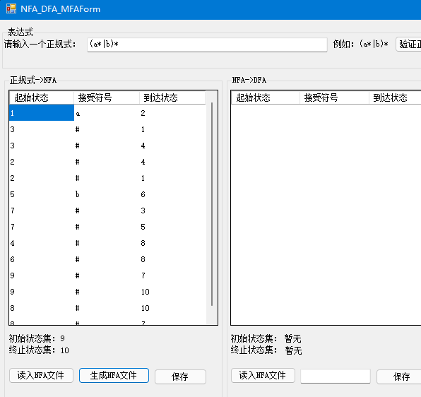

# 编译系统实验作业

## 一、分词器

### 1. 测试程序

```c
5. .5
int ab,2ab1;
for (f12=10.8;f12<=10.98.5;f21++)
   f12+=f21+++1000
100 + 100
100+100
-100
-19.8
+10.8
```

### 2. 结果截图


## 二、自动机

1. 判断正规式合法性
2. 正规式转NFA
     
