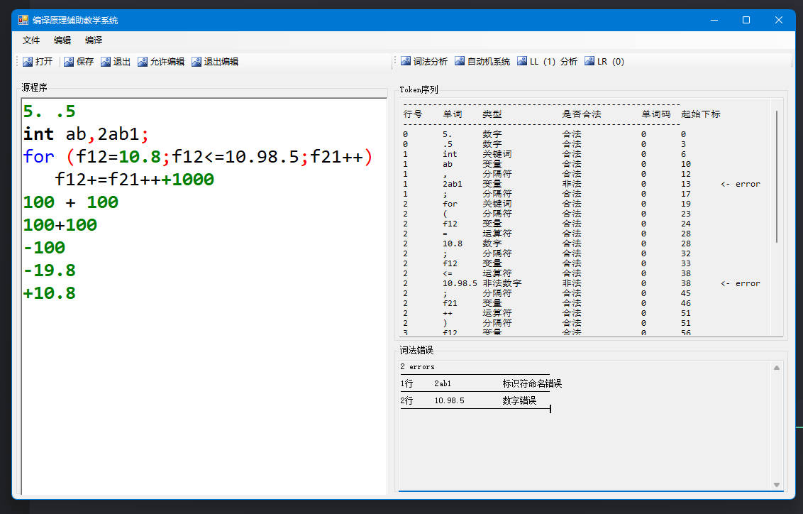
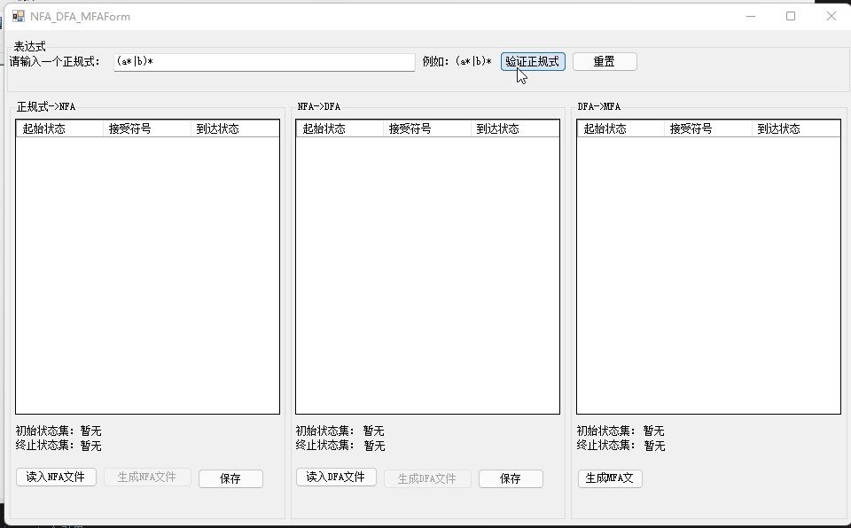
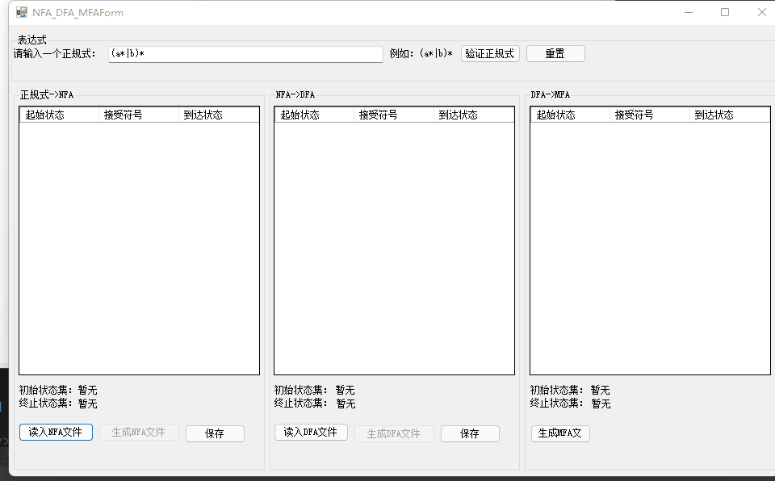

# 编译原理实验作业

## 一、分词器

### 1. 测试程序

```c
5. .5
int ab,2ab1;
for (f12=10.8;f12<=10.98.5;f21++)
   f12+=f21+++1000
100 + 100
100+100
-100
-19.8
+10.8
```

### 2. 结果截图



## 二、自动机

1. 判断正规式合法性
2. 正规式转NFA
3. NFA转DFA
   - 从正规式
   
   - 文件读入
   

   主要代码：
   ```csharp
   /// <summary>
   /// 将NFA转换为DFA
   /// </summary>
   /// <returns>转换后的DFA</returns>
   public PathList NFAToDFA()
   {
      T = new List<SortedSet<int>>(); // 书上构造的状态K的子集（C）
      Debug.WriteLine("nfa to dfa...");
      List<Path> paths = new List<Path>();
      List<char> vals = getVals().ToList(); // 获取输入字符集
      int cnt = 0;

      SortedSet<int> set = new SortedSet<int>();
      set.Add(nfaPathList.head); // 首先将head加入集合里 也就是K0
      T.Add(emptyClosure(set)); // C 集合里添加K0
      // tStr 这个数列是为了判断状态集是否存在
      // 相同的状态集转换成的字符串肯定是相等的
      tStr.Add(String.Join(",", emptyClosure(set).ToList()));
      cnt++; // C集合内的成员数量加一
      Debug.WriteLine("closure(0): " + String.Join(",", emptyClosure(set).ToList())); // 输出K0的闭包
      for (int i = 0; i < T.Count; i++)
      {
            SortedSet<int> t = T[i]; // 此时t为未被标记的状态集（因为还未对它进行move操作）
            vals.ForEach(val =>
            {
               Debug.WriteLine("val: " + val);
               SortedSet<int> u = emptyClosure(move(t, val)); // move后的闭包
               string uStr = string.Join(",", u.ToList()); // 转换为字符串
               Debug.WriteLine("u: " + uStr);

               if (uStr != "" && !isExist(tStr.ToArray(), uStr)) // 如果既不为空也不存在
               {  /**                 val
                  *  添加一条线 i --------------> cnt + 1
                  **/
                  paths.Add(new Path(i, cnt++, val));
                  Debug.WriteLine("add....");
                  T.Add(u);
                  tStr.Add(uStr);
               } 
               else
               {
                  /** 如果已经存在 就找它的序号添加一条路径
                  *               end
                  *   i ---------------------- end
                  */
                  int end = tStr.FindIndex(str => str == uStr);
                  paths.Add(new Path(i, end, val));
               }
            });
      }

      Debug.WriteLine("============result============");
      tStr.ForEach(val => Debug.WriteLine(val.ToString()));

      return new PathList(0, cnt - 1, paths);
   }
   ```

   更多代码参见：[这里](https://github.com/mayapony/compiler-app/commit/d09aef4ea626247c2f39ff39c83f0e00458b58be)
